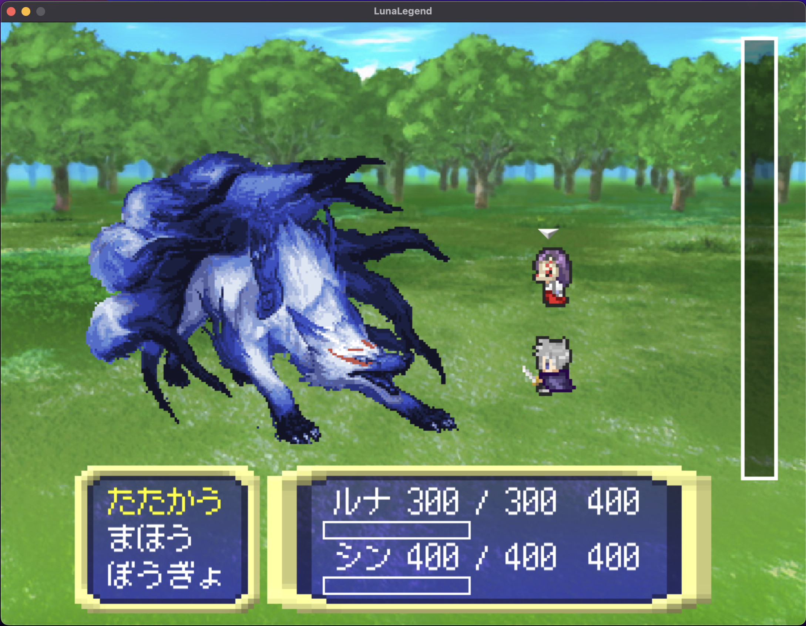
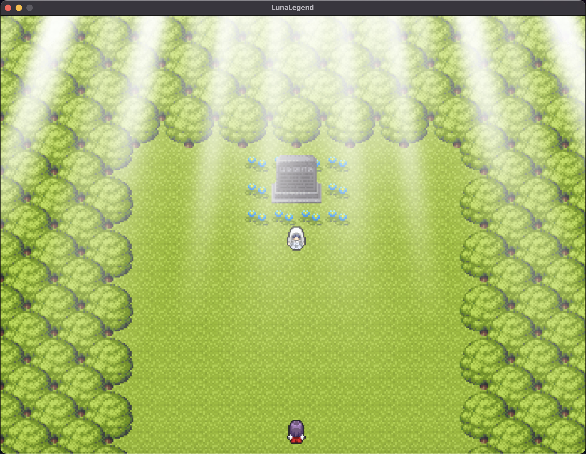

# 概要
pythonのライブラリであるpygameを用いて制作したFF風RPG

# サンプル画面
|タイトル画面|戦闘画面|フィールド画面|
|:-:|:-:|:-:|
||||

# 使用言語・ライブラリ
- Python 3.12.3
- Pygame 2.5.2

# 素材一覧
- フォント
    - [フロップデザイン](https://flopdesign.booth.pm/)
- キャラクタードット絵
    - [グラフィック合成器](http://blog.pipoya.net/blog-entry-515.html)
- マップ素材
    - [ぴぽや倉庫](https://pipoya.net/sozai/)
- UI系
    - [ぴぽや倉庫](https://pipoya.net/sozai/)
- 戦闘背景-
    - [ぴぽや倉庫](https://pipoya.net/sozai/)
- タイトル背景
    - [ゲームまてりあるず](https://game-materials.com/)
- 敵イラスト
    - [鳥橋Den](https://torihasi.blog.fc2.com/page-0.html)
- ドット絵変換
    - [ドット絵こんばーた](https://app.monopro.org/pixel/) 
- BGM
    - [ユーフルカ](https://youfulca.com/) 
- SE
    - [MusMus](https://musmus.main.jp/se.html)
    - [効果音ラボ](https://soundeffect-lab.info/sound/battle/)
